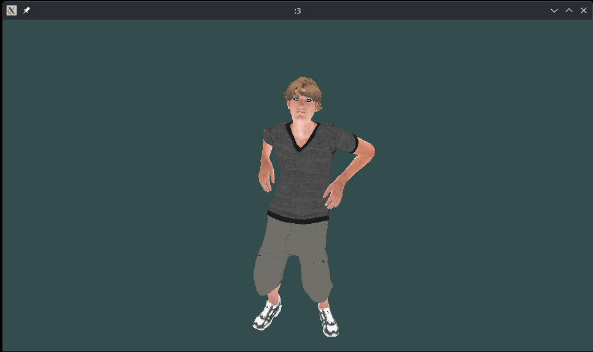

# Skinning
Il progetto mira a dimostrare la tecnica dell'animazione scheletrica (skinning). Il programma può caricare qualsiasi scena che contenga almeno una telecamera.
La scena fornita in esempio dimostra l'animazioni di un personaggio umano.

## Architettura
L'architettura del programma si ispira fortemente al formato glTF (sviluppato da Khronos Group e utilizzato per la condivisione di scene 3D), seppur con alcune semplificazioni. La scena è rappresentata da un albero; ciascun nodo può avere dei figli (altri nodi) e degli elementi (telecamere, mesh, scheletri, ...).
## Dipendenze

 - glfw
 - glew

## Compilazione
### Linux
È sufficente eseguire `make` all'interno della cartella radice del progetto.
Per eseguire l'applicazione 

    ./bin/skinning

### Windows

È sufficente eseguire `makewindows.bat` all'interno della cartella radice del progetto.
Per eseguire l'applicazione, sempre dalla cartella radice, eseguire

    runwindows.bat
   
